# Juice SQL Mapper Framework Architecture

## Overview

Juice is a SQL mapper framework for Go, inspired by MyBatis. It provides a simple, lightweight, and extensible way to interact with databases using XML-based SQL mappings.

## Architecture Diagram

```mermaid
graph TD
    %% Main Components
    subgraph "Application Layer"
        A[Application Code] --> B[Manager Interface]
        A --> C[GenericManager<T>]
        A --> D[TxManager Interface]
    end

    subgraph "Core Engine"
        B --> E[Engine]
        C --> E
        D --> F[BasicTxManager]
        F --> E
    end

    subgraph "Configuration Layer"
        E --> G[Configuration Interface]
        G --> H[xmlConfiguration]
        H --> I[environments]
        H --> J[Mappers]
        H --> K[keyValueSettingProvider]
    end

    subgraph "Mapper Layer"
        J --> L[Mapper]
        L --> M[xmlSQLStatement]
        L --> N[SQLNode]
    end

    subgraph "Execution Layer"
        E --> O[SQLRowsExecutor]
        F --> O
        O --> P[GenericExecutor<T>]
        P --> Q[StatementHandler]
        Q --> R[batchStatementHandler]
        Q --> S[queryBuildStatementHandler]
        Q --> T[sliceBatchStatementHandler]
        Q --> U[mapBatchStatementHandler]
        Q --> V[preparedStatementHandler]
    end

    subgraph "Database Layer"
        Q --> W[Session Interface]
        W --> X[sql.DB]
        W --> Y[sql.Tx]
        X --> Z[(Database)]
        Y --> Z
    end

    subgraph "Driver Layer"
        E --> AA[Driver Interface]
        AA --> AB[MySQLDriver]
        AA --> AC[PostgresDriver]
        AA --> AD[SQLiteDriver]
        AA --> AE[OracleDriver]
    end

    subgraph "Middleware Layer"
        E --> AF[MiddlewareGroup]
        AF --> AG[DebugMiddleware]
        AF --> AH[TimeoutMiddleware]
        AF --> AI[useGeneratedKeysMiddleware]
        AF --> AJ[TxSensitiveDataSourceSwitchMiddleware]
    end

    subgraph "Result Mapping"
        P --> AK[ResultMap Interface]
        AK --> AL[SingleRowResultMap]
        AK --> AM[MultiRowsResultMap]
        AM --> AN[rowDestination]
    end

    subgraph "Parsing Layer"
        H --> AO[XMLParser]
        AO --> AP[XMLEnvironmentsElementParser]
        AO --> AQ[XMLSettingsElementParser]
        AO --> AR[XMLMappersElementParser]
        AR --> AS[Node Types]
        AS --> AT[IfNode]
        AS --> AU[WhereNode]
        AS --> AV[SetNode]
        AS --> AW[TrimNode]
        AS --> AX[ForeachNode]
        AS --> AY[IncludeNode]
        AS --> AZ[ChooseNode]
    end

    subgraph "Evaluation Engine"
        AT --> BA[eval.Expression]
        AZ --> BA
        AX --> BA
    end

    subgraph "Utility Layer"
        BB[Binder Functions]
        BC[Runner Interface]
        BD[Param Interface]
    end

    %% Relationships
    E -.-> BF[Configuration]
    E -.-> BG[DB Connection]
    E -.-> BH[Driver]
    E -.-> BI[Middleware]
    
    classDef layer fill:#f9f,stroke:#333,stroke-width:2px;
    classDef component fill:#bbf,stroke:#333,stroke-width:1px;
    
    class A,B,C,D,E,F,G,H,I,J,K,L,M,N,O,P,Q,R,S,T,U,V,W,X,Y,AA,AB,AC,AD,AE,AF,AG,AH,AI,AJ,AK,AL,AM,AN,AO,AP,AQ,AR,AS,AT,AU,AV,AW,AX,AY,AZ,BA,BB,BC,BD,BF,BG,BH,BI component;
```

## Key Components

### 1. Engine
The central component that manages database connections, configurations, and statement execution.

- **Engine**: Main implementation of the Manager interface
- **Configuration**: Holds environments, mappers, and settings
- **DBManager**: Manages database connections for different environments

### 2. Managers
Interfaces for executing SQL operations:

- **Manager**: Base interface for executing statements
- **GenericManager<T>**: Type-safe manager for specific types
- **TxManager**: Transaction-aware manager with Begin/Commit/Rollback

### 3. Statements and Mappers
Handle SQL definitions and execution:

- **Statement**: Represents a SQL statement with action type (select, insert, update, delete)
- **Mapper**: Groups related statements under a namespace
- **Mappers**: Container for all mappers in the configuration

### 4. Execution Pipeline
Processes SQL execution through multiple layers:

- **SQLRowsExecutor**: Core executor returning sql.Rows
- **GenericExecutor<T>**: Typed executor for specific result types
- **StatementHandler**: Handles actual SQL execution
  - batchStatementHandler: For batch operations
  - queryBuildStatementHandler: For regular queries
  - preparedStatementHandler: For prepared statements

### 5. Database Abstraction
Provides database-agnostic interfaces:

- **Session**: Unified interface for sql.DB and sql.Tx
- **Driver**: Database driver abstraction with translators

### 6. Middleware System
Intercepts and enhances SQL execution:

- **Middleware**: Interface for query/exec interception
- **MiddlewareGroup**: Chain of middlewares
- **DebugMiddleware**: Logs SQL statements
- **TimeoutMiddleware**: Adds execution timeouts
- **useGeneratedKeysMiddleware**: Handles auto-generated keys

### 7. Result Mapping
Maps database results to Go structures:

- **ResultMap**: Interface for result mapping
- **SingleRowResultMap**: For single-row results
- **MultiRowsResultMap**: For multiple-row results
- **rowDestination**: Maps columns to struct fields

### 8. Parsing and Evaluation
Handles XML configuration and dynamic SQL:

- **XMLParser**: Parses XML configuration files
- **Node Types**: Dynamic SQL elements (if, where, set, foreach, etc.)
- **eval**: Expression evaluation engine

### 9. Utilities
Helper functions and interfaces:

- **Binder Functions**: Bind, List, List2, Iter for result processing
- **Runner**: Direct SQL execution interface
- **Param**: Parameter interface for SQL execution

## Data Flow

1. Application code uses Manager/Object() to get an executor
2. Executor builds SQL using Statement/Build() with parameters
3. Middleware chain processes the execution
4. StatementHandler executes the SQL through Session
5. Results are mapped using ResultMap implementations
6. Final results are returned to the application

## Key Features

- XML-based SQL mapping similar to MyBatis
- Dynamic SQL with conditional elements
- Type-safe generic executors
- Middleware support for cross-cutting concerns
- Transaction management
- Multiple database driver support
- Batch operation support
- Result mapping to structs